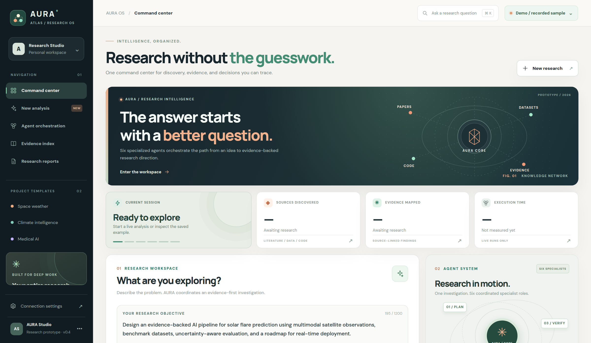
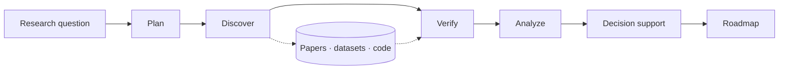

<div align="center">

# AURA Atlas
### Research intelligence, organized.

**An evidence-first, multi-agent research workspace — from the first question to a practical plan.**

[Explore the interactive demo](https://sagharganji.github.io/AURA-Research-Agent/) · [View the research example](AURA_demo_UI/sample_report.md) · [Deployment guide](DEPLOY.md)

</div>



*The actual AURA Atlas home screen. The public demo currently runs in **recorded-example mode**; live agent execution requires a separate backend deployment.*

---

## Why I built AURA

Research rarely stops at finding an answer. There are papers to evaluate, datasets to inspect, competing approaches to compare, assumptions to question, and decisions to turn into a realistic plan.

I built **AURA** to bring those steps into one workflow instead of treating research as a single chatbot response. AURA is an evolving Python multi-agent prototype paired with **Atlas**, its browser-based research workspace.

The first public milestone is now live: a responsive interface with an inspectable example report on **machine learning for solar flare prediction**. The research agents exist in the repository; connecting them to the public demo is the next deployment milestone.

## Take a look

**[Open the live AURA Atlas interface →](https://sagharganji.github.io/AURA-Research-Agent/)**

The hosted site works without a running local terminal. Choose **Open recorded example** to explore the saved research report, its linked evidence, the decision brief, and the implementation roadmap. You can also export the report as Markdown.

> **Demo status:** The hosted GitHub Pages site is a static frontend. Its saved solar-flare report is **not** regenerated for a new question. Running a new investigation requires the optional FastAPI backend, a supported cloud environment, configured external services, and an API key stored on the server.

## Inside the workspace

| Area | Purpose |
| --- | --- |
| **Research workspace** | Define the question and choose a starting research direction. |
| **Agent orchestration** | Visualize how specialist roles contribute to the research process. |
| **Evidence index** | Inspect the papers and datasets supporting the saved example. |
| **Decision brief** | Review findings, caveats, and a suggested technical direction. |
| **Research reports** | Read the executive summary, roadmap, or full report, then export Markdown. |

## The research pipeline

AURA brings together specialized responsibilities rather than asking one model to do everything.



- **Planning:** break an open-ended objective into smaller research tasks.
- **Discovery:** search scholarly literature via OpenAlex, datasets via DataCite, and open-source repositories via GitHub.
- **Verification and analysis:** organize retrieved evidence, assess support for claims, and compare approaches and gaps.
- **Decision and roadmap:** synthesize a technical direction with constraints, trade-offs, and implementation phases.

The architecture is implemented in Python; the website is the presentation layer. The visible agent diagram is not real-time execution telemetry.

## Example: solar flare forecasting

The recorded example asks AURA to investigate the design of a machine-learning system for predicting solar flares: find relevant literature and datasets, compare methods, identify limitations, and draft an implementation roadmap.

The resulting Markdown report contains a research plan, source links, evidence-linked findings, a method comparison, identified gaps, a decision brief, and phased next steps.

**[Read the recorded example →](AURA_demo_UI/sample_report.md)**

This example is an illustration of the workflow, not a claim of a trained or deployed solar-flare forecasting model. Sources, generated conclusions, and confidence statements require independent review.

## Technology

| Layer | Stack |
| --- | --- |
| Interface | HTML, CSS, JavaScript; responsive Atlas UI |
| Research orchestration | Python multi-agent pipeline |
| API | FastAPI / Uvicorn |
| LLM integration | Google Gemini API |
| Discovery tools | OpenAlex, DataCite, GitHub |
| Frontend hosting | GitHub Pages (live) |
| Optional API deployment | Docker + Google Cloud Run (planned / separately configured) |

## Run it locally

**Requirements:** Python 3.11+, Git, and a modern browser. You do **not** need a Gemini key to view the recorded example.

```bash
git clone https://github.com/sagharganji/AURA-Research-Agent.git
cd AURA-Research-Agent
python -m http.server 5500 -d AURA_demo_UI
```

Visit **http://localhost:5500** and select **Open recorded example**. If you are already inside `AURA_demo_UI`, use `python -m http.server 5500` instead.

For Python development and API testing, create a virtual environment and install the dependencies:

```bash
python -m venv .venv
# Activate your environment, then:
python -m pip install -r requirements.txt
python -m pip install pytest httpx
python -m pytest tests/test_api.py -q
```

For live research, configure `GEMINI_API_KEY` **only in the server environment**, start `uvicorn app.api:app --host 127.0.0.1 --port 8080`, and configure the public backend URL in `AURA_demo_UI/config.js`. Never place the API key in browser code or commit it to GitHub.

See **[DEPLOY.md](DEPLOY.md)** for the optional Cloud Run deployment plan and its cost, permission, and security considerations.

## Repository map

```text
AURA_demo_UI/           Atlas frontend + recorded report
app/
  agents/              Specialist research responsibilities
  tools/               External discovery integrations
  evidence/            Evidence collection / retrieval
  api.py               Optional FastAPI adapter
  main.py              Research orchestration
  report.py            Report generation
assets/                 Dashboard screenshot
tests/                  Offline checks
Dockerfile              Optional backend container
requirements.txt        Local development dependencies
requirements.backend.txt  Lean backend dependencies
DEPLOY.md               Deployment instructions
```

## What comes next

- Connect the existing research pipeline to the public interface through a hosted API.
- Add real-time execution status and a more inspectable citation trail.
- Expand evaluation, reproducibility checks, and research-history support.
- Add authentication and durable usage limits before any public deployment with paid inference.


---

<div align="center">

Built by **[Saghar Ganji](https://github.com/sagharganji)** · [Interactive demo](https://sagharganji.github.io/AURA-Research-Agent/)

*An evolving research prototype — not an autonomous scientific validation system.*

</div>
