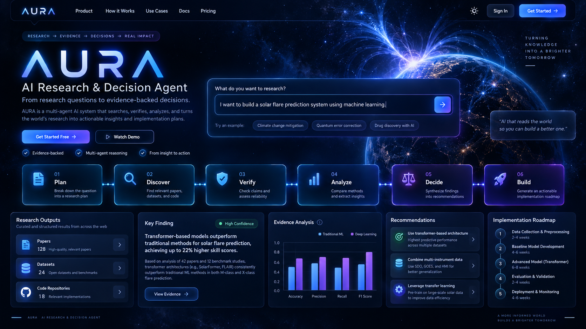

<p align="center">
  
</p>

<h1 align="center">AURA — AI Research & Decision Agent</h1>

<p align="center">
  <b>From complex questions to evidence-backed decisions.</b>
</p>

<p align="center">
A multi-agent AI research workspace that discovers knowledge, verifies evidence, analyzes approaches, and creates actionable implementation roadmaps.
</p>

<p align="center">
  
  
  
  
</p>

---

# Overview

Modern research often requires navigating thousands of papers, datasets, tools, and possible approaches.

AURA is designed as an intelligent research companion that helps transform an initial idea into a structured technical plan.

Instead of only generating responses, AURA follows a research-oriented workflow:

```
Research Question
        ↓
Planning
        ↓
Knowledge Discovery
        ↓
Evidence Verification
        ↓
Analysis
        ↓
Decision Support
        ↓
Implementation Roadmap
```

---

# Why AURA?

Traditional AI assistants focus on producing answers.

AURA focuses on building a **traceable research process**.

It helps users:

- Understand a complex problem
- Discover relevant scientific resources
- Compare technical approaches
- Validate information
- Create realistic implementation strategies

---

# Multi-Agent Architecture

```
                         AURA CORE

                            |
        -----------------------------------------
        |              |              |
   Planner Agent   Discovery Agent  Analysis Agent

        |              |              |

   Research      Papers / Data     Evidence
   Strategy      Sources           Evaluation

                            |

                    Decision Engine

                            |

                 Implementation Roadmap
```

---

# Agent Workflow

## 🧠 Planner Agent
Breaks down a broad question into research objectives and possible directions.

## 📚 Literature Agent
Identifies relevant scientific papers and research concepts.

## 🗂 Dataset Agent
Explores available datasets, benchmarks, and data sources.

## 🔍 Evidence Agent
Organizes and verifies supporting evidence.

## 📊 Decision Agent
Compares approaches and provides technical recommendations.

## 🚀 Roadmap Agent
Creates practical implementation steps.

---

# Example Scenario

### Input

```
Build an AI system for solar flare prediction.
```

### AURA explores:

- Relevant scientific literature
- Available solar datasets
- Machine learning approaches
- Evaluation strategies
- Implementation roadmap

### Output

A structured research report containing:

✓ Research direction  
✓ Evidence-backed findings  
✓ Recommended approaches  
✓ Development roadmap  

---

# Technology Stack

- Python
- Large Language Models
- Multi-Agent Systems
- Scientific Information Retrieval
- Dataset Discovery Pipelines
- Evidence-Based Reasoning
- Research Automation

---

# Project Roadmap

## Completed

✅ Research planning pipeline  
✅ Paper discovery workflow  
✅ Dataset discovery workflow  
✅ Evidence collection  
✅ Decision generation  

## Future Development

⬜ Advanced agent collaboration  
⬜ Interactive research memory  
⬜ Real-time knowledge updates  
⬜ Production deployment  

---

# Repository Structure

```
AURA-AI-Research-Agent/

├── app/
│   ├── agents/
│   ├── tools/
│   ├── main.py
│   └── llm.py
│
├── outputs/
├── tests/
├── requirements.txt
└── README.md
```

---

# Vision

AURA aims to bridge the gap between:

```
Research → Understanding → Decision → Implementation
```

by creating an AI workspace that supports researchers, engineers, and innovators.

---

# Author

**Saghar Ganji**

AI / Machine Learning Researcher

Areas of interest:

- Deep Learning
- AI Agents
- Scientific Machine Learning
- Research Automation

---

<p align="center">
AURA — Turning knowledge into actionable intelligence.
</p>
