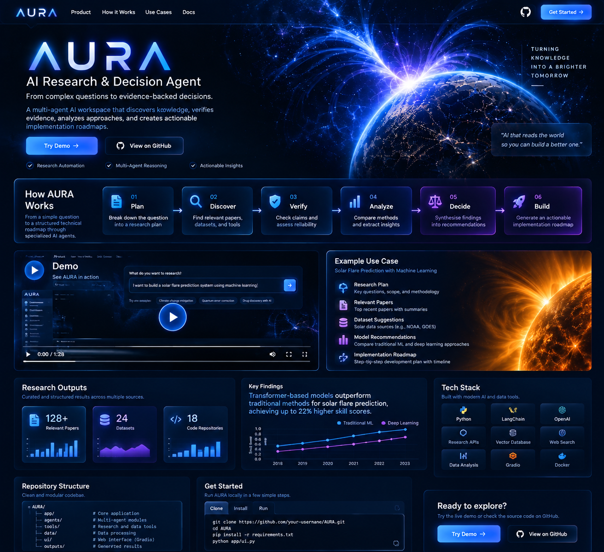
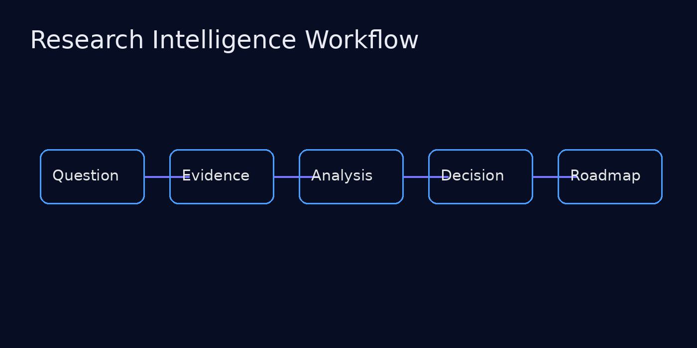
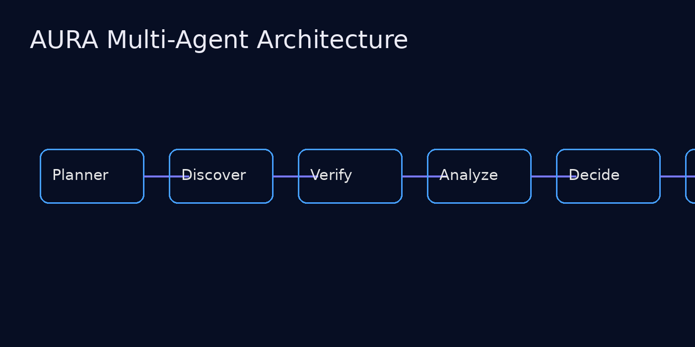

<p align="center">

</p>

<h1 align="center">AURA — AI Research & Decision Agent</h1>

<p align="center">
<b>From research questions to evidence-backed decisions.</b>
</p>

<p align="center">
A multi-agent AI workspace that transforms complex ideas into structured research plans, verified evidence, technical analysis, and actionable implementation roadmaps.
</p>

---

# 🌌 Overview

AURA is designed to support the complete research journey:

```
Research Question
        ↓
Planning
        ↓
Discovery
        ↓
Evidence Verification
        ↓
Analysis
        ↓
Decision Support
        ↓
Implementation Roadmap
```

---

# ✨ What AURA Does

| Capability | Description |
|---|---|
| 🧠 Research Planning | Converts ideas into structured research directions |
| 📚 Knowledge Discovery | Finds papers, datasets, and technical resources |
| 🔍 Evidence Analysis | Organizes and evaluates supporting information |
| 📊 Technical Comparison | Compares possible approaches |
| 🚀 Roadmap Generation | Creates implementation strategies |

---

<p align="center">

</p>

# 🧩 Multi-Agent Architecture

<p align="center">

</p>

---

# 🔬 Example Scenario

Input:

```
Build a machine learning system for solar flare prediction.
```

AURA helps organize:

✓ Research directions  
✓ Scientific literature  
✓ Dataset candidates  
✓ Model strategies  
✓ Evaluation plans  
✓ Development roadmap  

---

# 🛠 Technology Focus

- Python
- AI Agents
- Large Language Models
- Research Automation
- Scientific Information Retrieval
- Machine Learning Workflows

---

# 📂 Repository Structure

```
AURA-Research-Agent/

├── app/
│   ├── agents/
│   ├── tools/
│   └── main.py
│
├── assets/
│   ├── aura_dashboard.png
│   ├── architecture.png
│   └── workflow.png
│
├── outputs/
├── tests/
├── requirements.txt
└── README.md
```

---

# 🚀 Roadmap

✅ Research planning pipeline  
✅ Multi-agent workflow  
✅ Evidence organization  
✅ Decision support  

⬜ Advanced agent collaboration  
⬜ Research memory  
⬜ Real-time knowledge integration  
⬜ Production deployment  

---

# Author

**Saghar Ganji**

AI / Machine Learning Researcher

Research interests:
- Deep Learning
- AI Agents
- Scientific Machine Learning
- Research Automation
